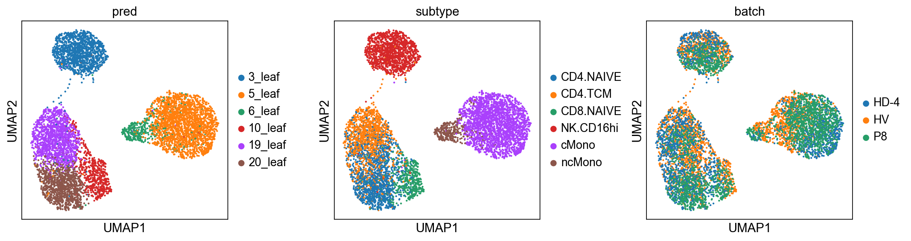
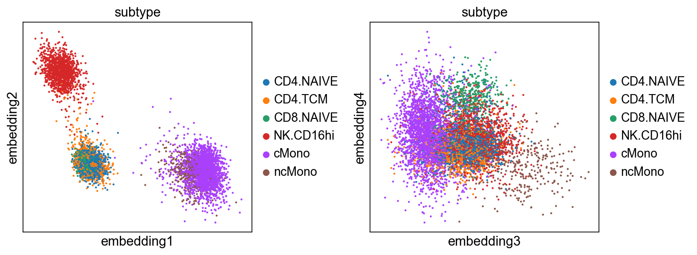
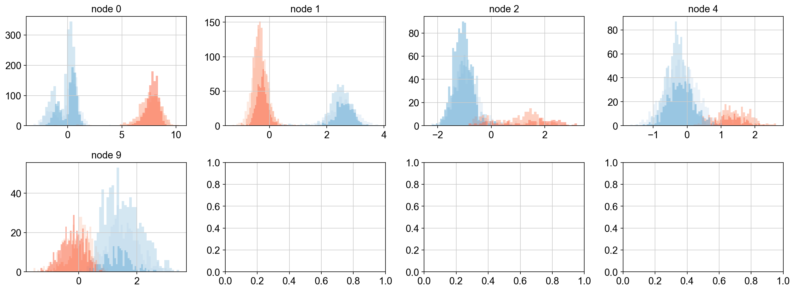

# Grounded Integration of Single-cell Multi-omics Data with CITE-pool

 


Grounded Integration of Single-cell Multi-omics Data with CITEpool

## Description

Integrating single-cell datasets across multiple sources and conditions requires principled,
explicit methods that ground cell identity in marker gene expression rather than implicit latent representations.
Existing integration approaches project cells into opaque latent spaces where integration logic cannot be directly inspected,limiting biological interpretability.
We propose CITE-pool, a cross-modal framework that integrates CITE-seq and scRNA-seq data through an explicit,
interpretable identity space where each dimension represents a cell-population partition defined by cross-batch-conserved marker gene signatures.
When surfaceome markers are incomplete, CITE-pool identifies cross-batch-conserved transcriptomic co-expressions to expand the identity space while preserving biological interpretability.
Compared to MultiVI, MIDAS, sciPENN and scMaMoT, CITE-pool achieves superior cross-batch consistency,
robustness to sparse or mismatched surface markers,
preservation of mismatched cell types,
and uniquely enables discovery of novel identity markers beyond the CITE-seq antibody panel.
In cross-condition analyses, CITE-pool disentangles identity-defining genes from condition-responsive genes,
clarifying the transcriptomic basis of cellular heterogeneity.
By making integration decisions transparent and grounded in biology,
CITE-pool provides a principled alternative to existing methods,
drawing insights into the complex transcriptomic landscape and cellular heterogeneity.

## Run
### Option 1: Run in Terminal
python CITEpool/RunCITEpool.py --data_path ./datasets/1/data.h5ad ./datasets/2/data.h5ad --output_path ./output 

### Option 2: Run in Jupyter Notebook
Refer to the file Tutorial.ipynb:

[An example for three CITE-seq datasets integration with CITE-pool](./Tutorial.ipynb)

## Run CITE-pool (Integration and Clustering)


```python
import scanpy as sc 
import pandas as pd
import RunCITEpool
import numpy as np
```


```python
data_path = ['./datasets/example/1/data.h5ad','./datasets/example/2/data.h5ad','./datasets/example/3/data.h5ad']
output_path = './outputs/example/'
cutoff = 0.1
current_treepath = None#'./outputs/example/'
FinetuneNonde = [5]
ifretrain = False


RunCITEpool.main(data_path, output_path, cutoff, 
                current_treepath, FinetuneNonde, ifretrain)

```

## Results Visualization

### Loading Data

#### Option 1: Load datasets under different folders in data_path


```python
## Load and concat RNA data
inbatch, adtdata, rnadata = [1], {}, {}
for i in range(len(data_path)):
    data = sc.read_h5ad(data_path[i])
    batch = data.obs['batch'].cat.categories
    # adtdata[i] = data[:,data.var['feature_types']=='Antibody Capture']     
    rnadata[i] = data[:,data.var['feature_types']=='Gene Expression']
    rnadata[i].obs['pred'] = None


    for j in range(len(batch)):
        file = str(i+1)+'/'+str(j+np.sum(inbatch))
        leaflabel = pd.read_csv(output_path+file+'/leaf_labels.csv',index_col=0)
        treelabel = pd.read_csv(output_path+file+'/treelabel.csv',index_col=0)
        embedding = pd.read_csv(output_path+file+'/embedding.csv',index_col=0)
        indices = rnadata[i].obs_names.isin(leaflabel.index)
        rnadata[i].obs['pred'][indices] = leaflabel['Label']
        
        if j == 0:
            rnadata[i].obsm['treelabel'] = np.zeros((rnadata[i].shape[0],embedding.shape[1]))
            rnadata[i].obsm['embedding'] = np.zeros((rnadata[i].shape[0],embedding.shape[1]))
        rnadata[i].obsm['treelabel'][indices] = treelabel.values
        rnadata[i].obsm['embedding'][indices] = embedding.values


    inbatch.append(j+1)

adata = sc.concat(rnadata.values(), axis=0, join='inner')

# adata.write_h5ad(output_path+'reuslt.h5ad')
```

#### Option 2: If datasets concatenated, directly load results


```python
import os
adata = sc.read_h5ad(output_path+'reuslt.h5ad')
adata.obs['pred'] = None
datasets_path = os.listdir(output_path)

for dataset in datasets_path:
    if dataset.isdigit() == False or dataset == '0':
        continue
    
    filename = os.listdir(output_path+dataset)
    if dataset == '1':
        adata.obsm['treelabel'] = np.zeros((adata.shape[0],embedding.shape[1]))
        adata.obsm['embedding'] = np.zeros((adata.shape[0],embedding.shape[1]))

    for file in filename:
        if file.isdigit() == False:
            continue
        leaflabel = pd.read_csv(output_path+dataset+'/'+file+'/leaf_labels.csv',index_col=0)
        treelabel = pd.read_csv(output_path+dataset+'/'+file+'/treelabel.csv',index_col=0)
        embedding = pd.read_csv(output_path+dataset+'/'+file+'/embedding.csv',index_col=0)

        indices = adata.obs_names.isin(leaflabel.index)

        adata.obs['pred'].loc[indices] = leaflabel['Label']
        adata.obsm['treelabel'][indices] = treelabel.values
        adata.obsm['embedding'][indices] = embedding.values


```

### Integrated data umap visualization with embedding


```python
sc.set_figure_params(facecolor='white')
sc.pp.neighbors(adata, n_neighbors=10, use_rep='embedding', key_added='embedding')
sc.tl.umap(adata, neighbors_key='embedding')
sc.pl.umap(adata, color=['pred','subtype','batch'],wspace=0.38)
```


    

    


### Visualization of each embedding


```python
sc.pl.embedding(adata, basis='embedding', components=['1,2','3,4',],color=['subtype'],wspace=0.38)
```


    

    


## Advanced Analysis

### Bimodal property of Pseudo-marker at each node layer


```python
tree_label = pd.DataFrame(adata.obsm['treelabel'], index=adata.obs_names, columns=treelabel.columns)

nbatch = 6
import matplotlib.pyplot as plt
import numpy as np
blue_colors = [plt.cm.Blues((x+1)/nbatch) for x in range(nbatch)]  
red_colors =[plt.cm.Reds((x+1)/nbatch) for x in range(nbatch)]    

fig, axes = plt.subplots(2,4, figsize=(16, 6))
for i in range(tree_label.shape[1]):#
    node = tree_label.columns[i]
    subdata = adata[tree_label[node]!=0]
    batches = sorted(subdata.obs['batch'].unique())  
    # if i != 1:
    #     continue
    
    for batch_idx, batch in enumerate(batches):
        batch_data = subdata[subdata.obs['batch'] == batch]
        # if batch not in ['P8']:
        #     continue
        
        
        mask_neg = (tree_label[node][batch_data.obs.index] == -1)
        axes[int(i/4), int(i%4)].hist(
            batch_data.obsm['embedding'][mask_neg, i],
            bins=40, alpha=0.5,
            color=blue_colors[batch_idx],
            # label=f'{batch} (label=-1)' if batch_idx == 0 else ""
        )
        
        
        mask_pos = (tree_label[node][batch_data.obs.index] == 1)
        axes[int(i/4), int(i%4)].hist(
            batch_data.obsm['embedding'][mask_pos, i],
            bins=40, alpha=0.5,
            color=red_colors[batch_idx],
            # label=f'{batch} (label=1)' if batch_idx == 0 else ""
        )
    axes[int(i/4), int(i%4)].set_title('node '+node)
    # axes[int(i/4), int(i%4)].legend()

plt.tight_layout()
plt.show() 
```


    

    


<!--  -->

<!-- ## Usage

### Input

The input of CITE-sort should be a csv file with CLR normalized CITE-seq ADT data (row: droplet/sample, col: ADT/feature). 

### Run

`python runCITEsort.py ADT_clr_file -c 0.1 -o ./CITEsort_out`

- -c, cutoff, the similarity threshold of merging Gaussian components; the default is 0.1. It should be a real value between 0 and 1. The bigger value leads to split more aggressively, and ends in a more complicated tree.
- -o, output, the path to save ouput files. If not specified, CITE-sort will create a folder "./CITEsort_out" in the current directory.

`python runCITEsort.py ADT_clr_file -c 0.1 -o ./CITEsort_out --compact`

- --compact, adding this parameter will output a compact tree. 

See analysis [tutorial](https://github.com/QiuyuLian/CITE-sort/blob/master/AnalysisTutorial.ipynb) for visualizing each node.  

### Outputs

- tree.pdf, the vasualized sort tree of input dataset created by CITE-sort.
  - There are three rows in each inner node:
    - "**n_marker(s)**": **n** is the node ID, which is obtained by Breath First Search. **marker(s)**, the surface markers next to the ID, is the subspace selected to subdivide the current population.
    - "**Num: xxx**": is the number of droplets in current population.
    - "**(a|b)**": **b** denotes the number of components determined by BIC in the selected surface marker subspace. **a** denotes the number of component-complexes after merging with a certain threshold. Generally, **a** <= **b**. **a** = **b** when all components can not be merged with current threshold.
  - The numbers next to the arrows denote the mean of the selected markers in the partition the arrow stands for. In leaf nodes, the means of all markers are marked if not using '--compact'. As CITE-sort takes CLR-format values as input, these numbers could be positive or negative. 
- leaf_labels.csv, the labels of each droplets in the sort tree.
- tree.pickle, the tree structure recording the main clusteirng infromation of input dataset.
- tree.dot, the auxiliary file to plot the tree.

## Examples

We provide 3 in-house and 5 public CITE-seq datasets in "./datasets":

- [PBMC_1k (10X Genomics)](https://support.10xgenomics.com/single-cell-gene-expression/datasets/3.0.0/pbmc_1k_protein_v3)
- [PBMC_1k_b (In house)](https://github.com/QiuyuLian/CITE-sort/tree/master/datasets)
- [PBMC_2k (In house)](https://github.com/QiuyuLian/CITE-sort/tree/master/datasets)
- [PBMC_5k (10X Genomics)](https://support.10xgenomics.com/single-cell-gene-expression/datasets/3.0.2/5k_pbmc_protein_v3)
- [PBMC_8k (10X Genomics)](https://support.10xgenomics.com/single-cell-gene-expression/datasets/3.0.0/pbmc_10k_protein_v3) 
- [MALT_8k (10X Genomics)](https://support.10xgenomics.com/single-cell-gene-expression/datasets/3.0.0/malt_10k_protein_v3)
- [CBMC_8k (GSE100866)](https://www.ncbi.nlm.nih.gov/geo/query/acc.cgi?acc=GSE100866)
- [PBMC_16k (with cell hashing) (In house)](https://github.com/QiuyuLian/CITE-sort/tree/master/datasets)

### Example Commond

**Example 1**: The PBMC_2k dataset is used as an example of beginning with CLR-format data.

`python preCITEsort.py ./datasets/PBMC_2k_ADT_clr.csv `

- plot histgram of each marker.

`python runCITEsort.py ./datasets/PBMC_2k_ADT_clr.csv `

- run CITE-sort and output a sort tree.

**Example 2**: ADTs from [GSE143363](https://github.com/QiuyuLian/CITE-sort/blob/master/datasets) are extracted from [GEO](https://www.ncbi.nlm.nih.gov/geo/query/acc.cgi?acc=GSE143363) and used as an example of begining with  raw counts.

`python preCITEsort.py ./datasets/GSE143363_ADT_Dx_count.csv --CLR `

- transform data into CLR format and plot histgram of each marker.

`python runCITEsort.py ./CITEsort_out/data_clr.csv --compact`

- run CITE-sort and output a sort tree in compact way.

## Authors

Qiuyu Lian\*, Hongyi Xin\*, Jianzhu Ma, Liza Konnikova, Wei Chen\#, Jin Gu\#,Kong Chen\#

## Maintainer

Qiuyu Lian, Hongyi Xin. -->


